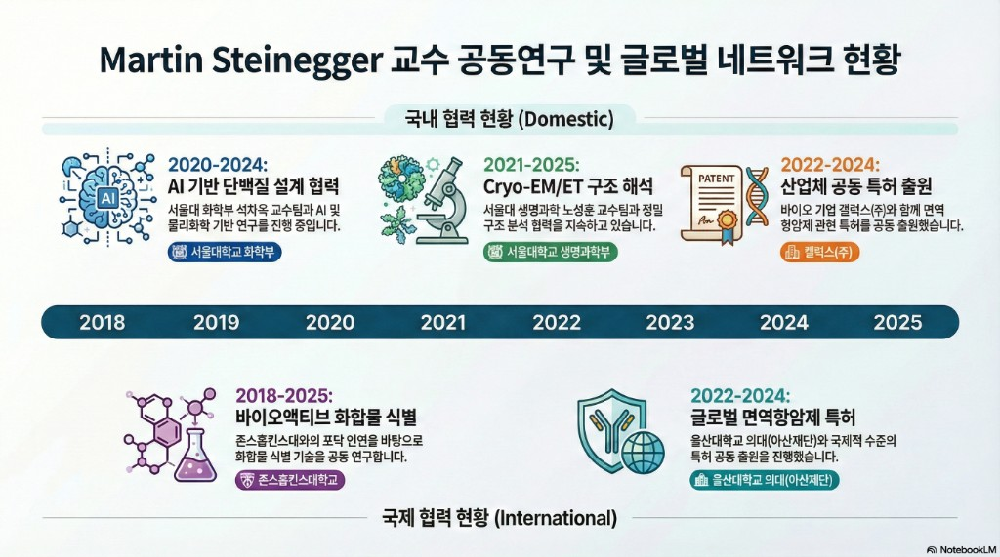
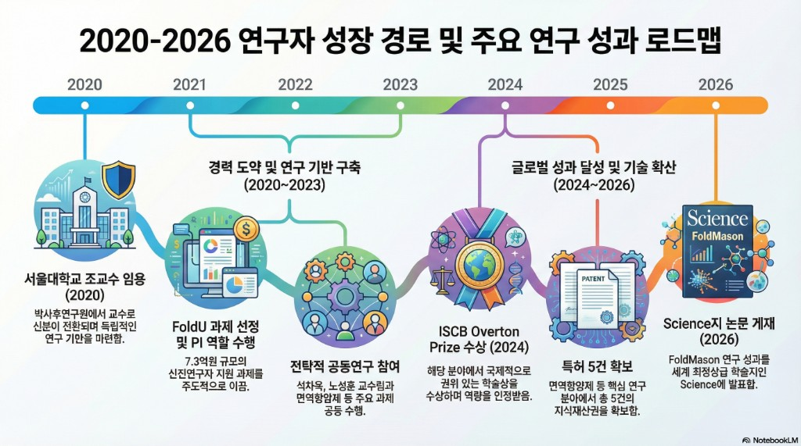

# FoldMason(Science, 2026) 성과 관련 과기정통부 지원사업 연계구조 분석

---

**작성일:** 2026년 2월 1일  
**데이터 출처:** 한국연구자정보(KRI), 국가과학기술지식정보서비스(NTIS)

---

## 1. 연구 성과 개요

### 1.1 논문 정보
- **논문명:** Multiple protein structure alignment at scale with FoldMason
- **게재지:** Science 
- **게재일:** 2026년 1월 30일 
- **연구책임자:** Martin Steinegger 교수 (서울대학교 생명과학부 부교수)

### 1.2 연구 의의
- 대규모 단백질 구조 빅데이터 기반 **초고속·고정밀 다중 정렬 분석 기술** 개발
- 기존 기술 대비 **100~1,000배** 빠른 속도, 높은 정확도 확보
- 수십억 년에 걸친 단백질 진화 과정 규명 가능
- 질병 관련 단백질 기능 차이 규명 및 신약 표적 발굴 기대

---

## 2. 연구자 프로필

### 2.0 인적사항
- **성명:** Martin Steinegger (마틴 슈타이네거)
- **국적:** 독일
- **소속:** 서울대학교 생명과학부
- **직위:** 부교수 (Associate Professor, 2024.03~)

> **참고:** Steinegger 교수는 독일에서 학사·석사·박사 학위를 취득한 후, 미국 Johns Hopkins University에서 박사후연구원 과정을 거쳐 **2020년 서울대학교 조교수로 직접 임용**됨. 독일이나 미국에서 교수직을 역임한 적 없이, 박사후연구원에서 바로 한국 대학 교수로 영입됨

### 2.1 학력

| 기간 | 학위 | 기관 | 전공 | 지도교수 |
|------|------|------|------|----------|
| 2014.08 ~ 2018.08 | **박사** | Technical University of Munich (독일) | 생물정보학/컴퓨터공학 | Prof. Burkhard Rost |
| 2013.04 ~ 2014.08 | 석사 | Ludwig Maximilian University of Munich (독일) | 생물정보처리 | Johannes Söding |
| 2010.09 ~ 2013.04 | 학사 | Technical University of Munich (독일) | 생물정보학 | Burkhard Rost |

### 2.2 경력

| 기간 | 기관 | 직위 | 비고 |
|------|------|------|------|
| **2024.03 ~ 현재** | **서울대학교** | **부교수 (Associate Professor)** | 정년트랙 승진 |
| 2020.03 ~ 2024.02 | 서울대학교 | 조교수 (Assistant Professor) | **국내 정착** |
| 2018.10 ~ 2020.02 | Johns Hopkins University (미국) | 박사후연구원 | 메타게놈 분석 방법론 개발 |
| 2014.08 ~ 2018.09 | Max Planck Institute for Biophysical Chemistry (독일) | 박사과정 | 정량/계산생물학 연구실 |
| 2012.05 ~ 2014.07 | Söding Lab, LMU Munich | 연구보조원 | Gene Centre |
| 2008.09 ~ 2011.06 | Accenture Technology Solutions | 컨설턴트 | 소프트웨어 엔지니어링 |

### 2.3 수상 이력

| 수상연월 | 수상명 | 수여기관 | 비고 |
|----------|--------|----------|------|
| **2024.07** | **ISCB Overton Prize** | 국제전산생물학회(ISCB) | **전산생물학 분야 최고 권위 젊은과학자상** |
| 2024.03 | 제1차 자연과학대학 연구상 | 서울대학교 자연과학대학 | 국내 연구 성과 인정 |

> **참고:** ISCB Overton Prize는 전산생물학/생물정보학 분야에서 **40세 미만 연구자**에게 수여하는 최고 권위의 상으로, 과거 수상자 중 다수가 이후 주요 학술지 게재 및 학계 리더로 성장함.

### 2.4 지식재산권 (특허)

| 출원일 | 특허명 | 출원국 | 공동출원인 | 관련 과제 |
|--------|--------|--------|-----------|----------|
| 2025.02 | Methods, Systems and Kits for Identifying Bioactive Compounds and Therapeutic Methods | 미국 | **서울대, Johns Hopkins University** | - |
| 2023.06 | 신규한 키뉴레니나제 및 이의 용도 | 한국 (등록완료) | 갤럭스(주), 서울대, 울산대, 아산재단 | 인실리코 단백질 설계 (석차옥 PI) |
| 2022.10 | 새로운 면역항암제용 키뉴레닌 가수분해효소 | PCT국제 | 갤럭스(주), 서울대, 울산대 | 인실리코 단백질 설계 (석차옥 PI) |
| 2022.08 | Methods, Systems and Kits for Identifying Bioactive Compounds | 미국 | **서울대, Johns Hopkins University** | - |

> **특허 분석:**  
> - **면역항암제 관련 특허 3건**: 석차옥 PI의 "인실리코 단백질 설계" 과제 성과물로, Steinegger의 AI 기반 단백질 구조 예측 기술이 활용됨  
> - **Johns Hopkins 공동 특허 2건**: 박사후연구원 시절 협력 관계가 국내 정착 후에도 지속되고 있음을 보여줌

### 2.5 공동연구 네트워크



---

## 3. 과학기술정보통신부 연구비 지원 현황

### 3.1 연구책임자(PI) 과제 (본인 주관)

| 과제명 | 사업명 | 기간 | 총 연구비 |
|--------|--------|------|----------|
| **FoldU: 머신러닝을 사용한 메타유전체 스케일 대규모 단백질 폴딩** | 기초연구사업/**신진연구자지원사업** | 2021.03 ~ 2026.02 (5년) | **728,581천원** |
| 단백질 상호작용체의 구조 수준 규명을 위한 AI 기반 정밀·고속 구조 예측 및 분류 기법 연구 | 기초연구사업 | 2024.12 ~ 2027.11 (3년) | **450,000천원** |

> **소계: 약 11.8억원**

### 3.2 참여연구원 과제 (공동연구)

| 과제명 | 연구책임자 | 사업명 | 기간 | 총 연구비 |
|--------|-----------|--------|------|----------|
| 고해상도 입체 구조 해석을 위한 Cryo-EM/ET 이미징 연계 기술개발연구 | 노성훈 (서울대) | 원천기술개발사업 | 2021~2025 | 2,275,000천원 |
| 인공지능과 물리화학을 결합한 인실리코 단백질 설계 | 석차옥 (서울대) | 원천기술개발사업 | 2020~2024 | 2,672,100천원 |
| 유전체 수준 단백질 구조 모델링 | 석차옥 (서울대) | SW전문인력역량강화 | 2016~2018 | 878,686천원 |
| 독창적인 GPCR 구조 모델링 및 도킹 방법 개발 | 석차옥 (서울대) | 개인기초연구 | 2016~2018 | 833,250천원 |

> **소계: 약 66.6억원 (참여)**

---

## 4. FoldMason 성과와 연구비 지원의 연계성 분석

### 4.1 공식 지원 사업 (보도자료 기준)

기사에서 언급된 지원 사업:
- **기초연구사업** (우수 신진 연구지원 트랙)
- **합성생물학 기술 개발사업**

### 4.2 실제 기여 과제 추정

```
┌─────────────────────────────────────────────────────────────────────┐
│  【핵심 기여 과제】                                                    │
│                                                                     │
│  ★ FoldU 과제 (2021~2026, 신진연구자지원)                            │
│     → FoldMason의 핵심 알고리즘 개발                                  │
│     → 메타유전체 스케일 단백질 폴딩 기술                              │
│                                                                     │
│  【참여연구원 과제】 ※ 구체적 역할은 미확인                            │
│                                                                     │
│  ◆ 인실리코 단백질 설계 (석차옥 PI, 2020~2024)                       │
│     → 원천기술개발사업                                               │
│                                                                     │
│  ◆ Cryo-EM/ET 기술개발 (노성훈 PI, 2021~2025)                       │
│     → 원천기술개발사업                                               │
└─────────────────────────────────────────────────────────────────────┘
```

### 4.3 연도별 지원 추이

| 연도 | 신진연구(PI) | 원천기술(참여) | 누적 투자 |
|------|-------------|---------------|----------|
| 2020 | - | 375,000 | 375,000 |
| 2021 | 148,690 | 1,145,000 | 1,668,690 |
| 2022 | 148,690 | 1,325,000 | 3,142,380 |
| 2023 | 148,690 | 1,300,000 | 4,591,070 |
| 2024 | 133,821 | 952,100 | 5,676,991 |
| 2025 | 148,690 | 1,035,000 | 6,860,681 |

> **총 투자 규모: 약 68.6억원** (신진연구 7.3억 + 참여과제 61.3억)

---

## 5. 성과 창출 배경 분석

### 5.1 국제 인재 영입 및 정착 지원

- **2020년:** 독일 출신 Steinegger 교수 서울대학교 조교수 임용
- **신진연구자지원사업** 즉시 선정 → 독립적 연구 기반 마련
- **2024년:** 부교수 승진 → 국내 연구 역량 인정

### 5.2 연구 네트워크 구축

```
석차옥 교수 (서울대 화학부)
    └── 인실리코 단백질 설계 과제 (2020~)
         └── Steinegger 참여연구원
              └── AI 기반 구조 예측 기술 협력

노성훈 교수 (서울대 생명과학부)
    └── Cryo-EM/ET 기술개발 과제 (2021~)
         └── Steinegger 참여연구원
              └── 실험 검증 및 구조 데이터 확보
```

### 5.3 성과 창출 경로

1. **기초 역량 축적** (2020~2022)
   - 신진연구자지원으로 FoldU 알고리즘 개발
   - 석차옥/노성훈 교수와 공동연구 참여

2. **기술 고도화** (2023~2024)
   - 대규모 단백질 구조 정렬 알고리즘 완성
   - 트와일라이트 존 분석 기술 확보

3. **세계적 성과** (2025~2026)
   - FoldMason 개발 완료
   - Science 게재 (2026.01.30)

---

## 6. 결론 및 시사점

### 6.1 성과 요약

| 항목 | 내용 |
|------|------|
| 지원 사업 (보도자료 기준)¹ | **기초연구사업**, **합성생물학 기술 개발사업** |
| 실제 확인 사업 (KRI/NTIS)² | 기초연구사업/신진연구자지원사업, 원천기술개발사업 |
| PI(연구책임자) 과제 연구비 | 약 **11.8억원** (2건) |
| 참여연구원 과제³ | 4건 (총 과제규모 약 66억원, 본인 배분액 미상) |
| 투자 기간 | 2020~2026 (약 6년) |
| 성과 | **Science 게재**, 세계 최고 수준 기술 확보 |

> **각주:**  
> ¹ 과기정통부 보도자료(2026.01.30)에서 "기초연구 사업"과 "합성생물학 기술 개발사업"의 지원으로 수행되었다고 명시됨.  
> ² 실제 Steinegger 연구자의 KRI/NTIS 연구비 이력을 조회한 결과, "합성생물학 기술 개발사업"과 정확히 일치하는 사업명은 확인되지 않음. 다만, **원천기술개발사업** 내 "인공지능과 물리화학을 결합한 인실리코 단백질 설계" 과제(석차옥 PI, 2020~2024) 등이 합성생물학 관련 사업으로 추정되어 본 분석에 포함함.  
> ³ 참여연구원 과제의 경우 총 과제규모만 확인 가능하며, Steinegger 연구자 본인에게 배분된 실제 연구비는 확인되지 않음.

### 6.2 연구자 성장 경로 요약



### 6.3 정책적 시사점

1. **신진연구자 지원의 중요성**
   - 우수 신진연구자 조기 발굴 및 집중 지원
   - 독립 연구 기반 마련을 통한 장기 성과 창출
   - **사례:** 임용 직후 신진연구자지원사업 선정 → 5년간 안정적 연구 수행 → Science 게재

2. **국제 인재 영입 효과**
   - 글로벌 인재의 국내 정착 → 세계적 연구 성과
   - 국내 연구 인프라 및 지원 정책의 경쟁력 입증
   - **사례:** 독일 출신 → 미국 포닥 → 한국 직접 임용, ISCB Overton Prize 수상

3. **융합 연구 지원 체계**
   - 개인 기초연구 + 대형 원천기술개발 연계
   - AI-바이오 융합 분야 시너지 효과
   - **사례:** 본인 PI 과제 + 석차옥/노성훈 교수 과제 참여 → 특허 5건 창출

4. **산학연 협력 네트워크**
   - 국내외 대학, 연구기관, 기업 간 협력 촉진
   - **사례:** Johns Hopkins(미국), 갤럭스(주), 울산대/아산재단과 공동 특허

---

## 7. 참고자료

### 데이터 출처
- **KRI (한국연구자정보)**: https://www.kri.go.kr/kri2
  - 연구자 경력, 연구비 수혜 내역, 특허, 수상 이력 등 조회
- **NTIS (국가과학기술지식정보서비스)**: https://www.ntis.go.kr
  - 정부 R&D 과제 정보 교차 확인

### 연구실 정보
- **Steinegger Lab (Machine Learning & Bioinformatics)**: https://steineggerlab.com/en/
- **서울대학교 생명과학부 교수 소개**: https://biosci.snu.ac.kr/en/people/faculty?mode=view&profidx=94

### 논문
- Gilchrist, C.L.M., Mirdita, M., & Steinegger, M. (2026). *Multiple protein structure alignment at scale with FoldMason*. Science. https://science.org/doi/10.1126/science.ads6733

### 보도자료 및 기사
- 과학기술정보통신부 보도자료 (2026.01.30). "단백질 구조 빅데이터의 '정렬(Alignment)' 고속도로 열렸다"

### 기타
- **GitHub (FoldMason)**: https://github.com/steineggerlab/foldmason
- **ISCB Overton Prize 2024**: https://www.iscb.org/iscb-awards/overton-prize

---

**끝.**
